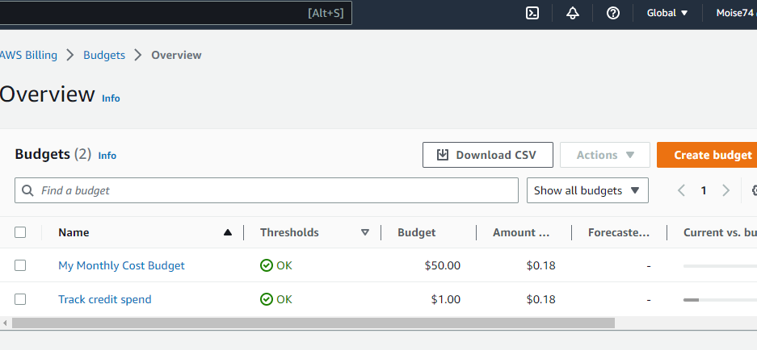

# Week 0 — Billing and Architecture

## Required Homework

### 1.Recreated the Logical archtectural Diagram

I recreated the Logical diagram using Lucid charts with the help of aws icons found in the library.

And I added new library to import  the serverless caching image.

This is the link to [lucid chart](https://lucid.app/lucidchart/8086e14d-aebb-45e7-a88b-ccb35bddc8f7/edit?invitationId=inv_00fa8f1e-24f7-4127-8dcb-fc858bc7d102&page=0_0#)

The image below is the screenshoot of archtectural diagram.

%20of%20week%200.png)

#### 2. Creating Budget 

I created two different budgets , one is for credits to $1 , with threshold  set to 85% for notification purpose

and if exceeded I can then take some decisions and

The second one ,is for the set amount to be used apart from those, gained due to the  aws credits ,Equal to $50 and enabled threshold to 85%. 

Below is the screenshoot



#### 3.Billing alarm

I created the billing alarm  for monitoring the estimated AWS charges for my AWS account(s),

I can be alerted and proactively notified when the calculated estimated charges exceed the defined threshold, both from the AWS CloudWatch console and via SNS

Notification.

Below is the Screenshoot of set billing alarm


###### 4. Created AWS CLI

I was not able to Intall aws cli using vs code due to the browser issues , but I Tried to Install it using 

the local environment .

And I tried to type there some AWS cli commands to see if it has installed successfully.

I installed aws cli Version 2 and I followed the steps as it appears on the [AWS Command Line Interface page](https://docs.aws.amazon.com/cli/latest/userguide/getting-started-install.html)

I tried the following command
```
aws sts get-caller-identity  : to see my credentials

```

Below is the screenshoot


